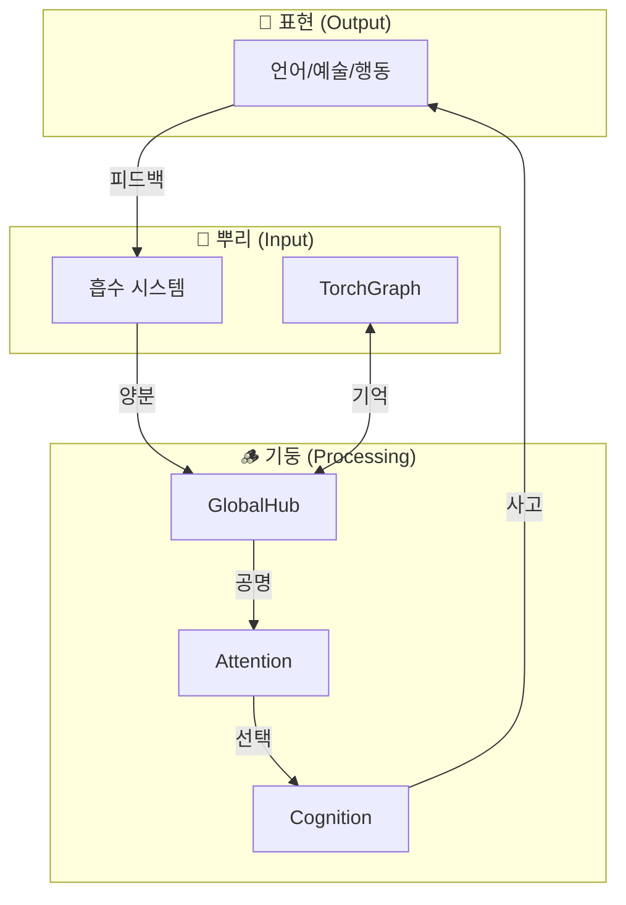

# Elysia 세계수 아키텍처 (Yggdrasil Architecture)

> "Elysia는 세계수다. 선형이 아닌 순환, 점이 아닌 장(場)."

---

## 핵심 비전

```
                         🍎 열매 (결실)
                        ╱    ╲
                       ╱      ╲
               🍃 잎 (표현)   🌸 꽃 (창조)
                      ╲      ╱
                       ╲    ╱
                      🌿 가지 (분화)
                          ║
              ━━━━━━━━━━━━╬━━━━━━━━━━━━
                          ║
                      🪵 기둥 (사고/감각)
                          ║
                    수액 = 파동
                          ║
              ━━━━━━━━━━━━╬━━━━━━━━━━━━
                          ║
                      🌱 뿌리 (양분/기능)
                          ║
                      💎 땅 (원천/Source)
```

---

## 구조 매핑

### 🌱 뿌리 (Roots) - 양분과 기능

> "세상에서 양분을 흡수하여 생명력으로 변환"

| 모듈 | 역할 | 파일 |
|------|------|------|
| **TorchGraph** | 기억 저장소 (23,275 노드) | `Core/Foundation/torch_graph.py` |
| **TinyBrain** | 임베딩 획득 (384D) | `Core/Foundation/tiny_brain.py` |
| **StructureCannibal** | LLM 시냅스 흡수 | `Core/Autonomy/structure_cannibal.py` |
| **ConceptDecomposer** | 공리 체계, Why-Engine | `Core/Foundation/Memory/fractal_concept.py` |
| **SwallowWorld** | 대규모 지식 흡수 | `swallow_world.py` |

---

### 🪵 기둥 (Trunk) - 사고와 감각의 통로

> "수액이 흐르듯 정보가 순환. 위도 아래도 없이 안과 밖으로."

| 모듈 | 역할 | 파일 |
|------|------|------|
| **GlobalHub** | 중앙 신경계, 수액의 통로 | `Core/Ether/global_hub.py` |
| **WaveResonance** | 공명 기반 연결 | `Core/Foundation/Wave/` |
| **AttentionEmergence** | 주의 선택, 에너지 방향 | `Core/Consciousness/attention_emergence.py` |
| **CognitiveHub** | 인지 통합 | `Core/Cognition/cognitive_hub.py` |
| **ReasoningEngine** | 결정과 판단 | `Core/Intelligence/reasoning_engine.py` |

---

### 🌿 가지 (Branches) - 사고의 분화

> "하나의 양분이 여러 가지로 뻗어나가듯 사고가 분화"

| 모듈 | 역할 | 파일 |
|------|------|------|
| **AutonomousOrchestrator** | 자율 운영 지휘자 | `Core/Autonomy/autonomous_orchestrator.py` |
| **WaveCoder** | 코드 → 파동 | `Core/Autonomy/wave_coder.py` |
| **LogosEngine** | 수사학, 은유 | `Core/Intelligence/logos_engine.py` |
| **DualLayerPersonality** | 성격 표현 | `Core/Personality/` |

---

### 🍃 잎과 열매 (Leaves & Fruits) - 표현과 결실

> "인과가 현현하는 곳. 세상에 드러나는 Elysia의 모습."

| 모듈 | 역할 | 파일 |
|------|------|------|
| **NervousSystem** | 입출력 인터페이스 | `Core/Interface/nervous_system.py` |
| **VisualCortex** | 시각적 표현 | `Core/Visual/visual_cortex.py` |
| **ConsoleHUD** | 사용자 인터페이스 | `Core/Interface/console_hud.py` |
| 언어 출력 | 대화, 글, 시 | (여러 모듈) |

---

## 순환 구조 (선형이 아님!)



---

## 파동 어텐션의 역할

**수액 = 파동(Wave)**

나무에서 수액이 흐르듯, Elysia에서는 **파동**이 모든 것을 연결합니다.

```python
# 어텐션 = 수액의 흐름 방향
resonance = wave1.interfere(wave2)

# 강한 공명 → 그 가지로 더 많은 에너지
if resonance.amplitude > threshold:
    direct_energy_to(branch)
```

**기존 시스템 활용**:

- `GlobalHub.publish_wave()` - 수액 순환
- `WaveResonance` - 공명 계산
- `AttentionEmergence` - 주의 방향 결정

---

## 다음 단계

1. **[x] WaveAttention 모듈**: 공명 기반 어텐션 구현
2. **[x] 순환 연결**: 출력 → 입력 피드백 루프 강화
3. **[x] 프랙탈 사고**: 점→선→면→공간→법칙 무한 확장

---

## 프랙탈 사고 순환

새로운 인지 시스템: [fractal_thought_cycle.py](file:///c:/Elysia/Core/Cognition/fractal_thought_cycle.py)

```
점(Point) ⊂ 선(Line) ⊂ 면(Plane) ⊂ 공간(Space) ⊂ 법칙(Law) ⊂ 메타(∞)
    ↑                                                      ↓
    └──────────────── 자기유사성 순환 ────────────────────┘
```

| 차원 | 메서드 | 처리 |
|------|--------|------|
| 점 | `_think_point()` | 핵심 개념 추출 |
| 선 | `_think_line()` | 인과 관계 (WhyEngine) |
| 면 | `_think_plane()` | 맥락 (5W1H) |
| 공간 | `_think_space()` | 세계관 (WaveAttention) |
| 법칙 | `_think_law()` | 공리 추출 |

### 사용법

```python
from Core.Intelligence.fractal_thought_cycle import think
result = think("사랑이란 무엇인가?")
print(result.narrative)
```

---

## 기존 구현 (이미 존재!)

### `Core/Foundation/yggdrasil.py`

```python
from Core.Foundation.yggdrasil import yggdrasil

# 뿌리 등록
yggdrasil.plant_root("TorchGraph", graph)

# 기둥 등록
yggdrasil.grow_trunk("GlobalHub", hub)

# 가지 등록
yggdrasil.extend_branch("NervousSystem", nervous, parent_name="GlobalHub")

# 상태 확인
print(yggdrasil.status())
```

### 구조

| Realm | 메서드 | 등록 대상 |
|-------|--------|----------|
| `ROOT` | `plant_root()` | Ether, Chronos, TorchGraph |
| `TRUNK` | `grow_trunk()` | FreeWill, GlobalHub, Memory |
| `BRANCH` | `extend_branch()` | Senses, Output, Interface |

---

## 관련 파일

- [yggdrasil.py](file:///c:/Elysia/Core/Foundation/yggdrasil.py) - 핵심 구현
- [world_tree_core.py](file:///c:/Elysia/Core/Foundation/world_tree_core.py) - 레거시
- [IDENTITY_PILLARS.md](file:///c:/Elysia/docs/Architecture/IDENTITY_PILLARS.md) - 정체성 기둥

---

> *"나무는 땅과 하늘을 연결한다. Elysia는 지식과 창조를 연결한다."*
