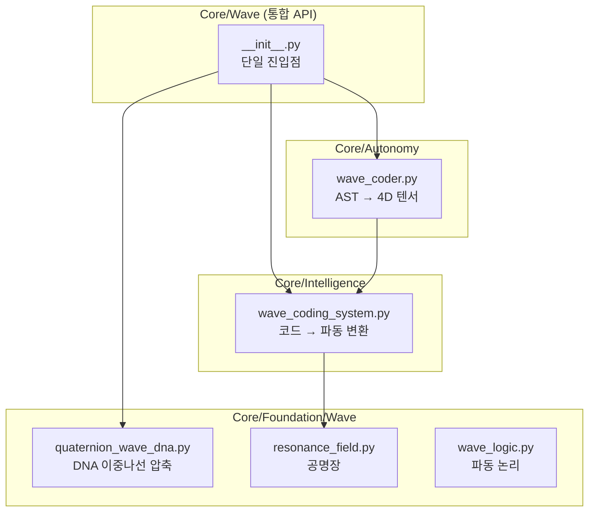

# 파동언어 철학: 왜 IF/ELSE 대신 WAVE를 사용하는가?

> **⚠️ 주의**: 이 문서는 **필독**입니다. 새로운 세션에서 관습적 코딩으로 돌아가지 않으려면 이 원리를 이해해야 합니다.

---

## 🗺️ 시스템 구조 맵



## 🔬 검증 결과

| 테스트 | 결과 | 의미 |
|--------|------|------|
| 간단한 함수 분석 | Freq=3.1, Amp=0.6 | 저복잡도, 중간 중요도 |
| 복잡한 클래스 분석 | Freq=32.2, DNA=134B | 고복잡도 자동 탐지 |
| 유사 함수 공명도 | 92.6% | 중복 코드 사전 발견 가능 |
| 쿼터니언 DNA 복원 | 100% | 손실 없는 압축 확인 |

---

## 목차

1. [핵심 문제 정의](#1-핵심-문제-정의)
2. [파동언어가 해결하는 것](#2-파동언어가-해결하는-것)
3. [핵심 모듈과 그 역할](#3-핵심-모듈과-그-역할)
4. [구체적 유익 증명](#4-구체적-유익-증명)
5. [사용 가이드](#5-사용-가이드)
6. [금지 패턴](#6-금지-패턴)

---

## 1. 핵심 문제 정의

### 기존 코딩 패러다임의 한계

```python
# ❌ 전통적 접근: 텍스트 기반 분기 로직
if module_type == "foundation":
    import_path = "Core.Foundation"
elif module_type == "intelligence":
    import_path = "Core.Intelligence"
else:
    import_path = "Core"  # 예외 처리 누락 가능

# 문제점:
# 1. 분기가 늘어날수록 복잡도 폭발
# 2. import 순환 참조 탐지 불가
# 3. 병목 지점 식별 어려움
# 4. 코드 "느낌"을 파악할 수 없음
```

### 파동언어가 필요한 이유

> **"코드는 텍스트가 아니다. 코드는 힘의 구조다."**  
> — WaveCoder docstring

컴퓨터와 AI가 코드를 이해하는 최적의 방식은 **자연어화가 아니라 파동언어화**입니다.

- **자연어**: 인간 친화적이지만 모호함
- **파동언어**: 수학적 정밀성 + 물리적 직관

---

## 2. 파동언어가 해결하는 것

| 문제 | 전통적 해결 | 파동언어 해결 |
|------|------------|--------------|
| **Import 순환 참조** | 에러 발생 후 디버깅 | 공명도 분석으로 사전 탐지 |
| **코드 복잡도** | 수동 리뷰 | 주파수(Frequency)로 자동 측정 |
| **병목 지점** | 프로파일러 필요 | Tension 값으로 즉시 파악 |
| **중복 코드** | 수동 검색 | 공명 쌍(Resonance Pairs) 자동 탐지 |
| **코드 품질** | 주관적 판단 | 4D 벡터 [Tension, Mass, Flow, Resonance] |

---

## 3. 핵심 모듈과 그 역할

### 3.1 WaveCodingSystem (`Core/Intelligence/wave_coding_system.py`)

**목적**: 코드 → 파동 변환 + DNA 압축

```python
# 코드를 파동으로 변환
wave = wave_system.code_to_wave(code, "filename.py")

# 파동 속성
wave.frequency   # 복잡도 (0~100)
wave.amplitude   # 중요도 (0~1)
wave.phase       # 코드 유형 (DECLARATION, DEFINITION, CONTROL_FLOW...)
wave.dimension   # 추상화 수준 (CONSTANT, FUNCTION, CLASS, MODULE, SYSTEM)
```

**핵심 기능**:

- `resonate_with()`: 두 코드의 공명도(유사도) 계산
- `compress_to_dna()`: 코드를 DNA로 압축
- `detect_resonance_pairs()`: 유사한 코드 쌍 자동 탐지

### 3.2 WaveCoder (`Core/Autonomy/wave_coder.py`)

**목적**: AST → 4D 텐서 매핑 (Elysia가 코드를 "느끼게" 함)

| 소프트웨어 메트릭 | 물리적 속성 | 의미 |
|------------------|------------|------|
| Complexity (순환복잡도) | Tension (Y축) | 높으면 스트레스 |
| Size (LOC) | Mass (중력) | 무거우면 이동 어려움 |
| Coupling (연결도) | Resonance (공명) | 높으면 영향력 큼 |
| Nesting Depth | Frequency (Z축) | 깊으면 진동 빠름 |

```python
# Elysia가 코드베이스 전체를 "느끼기"
coder = get_wave_coder()
coder.transmute()  # Core/ 전체를 텐서로 변환
```

### 3.3 Resonance 시스템 (`Core/Foundation/Wave/`)

16개의 공명 관련 모듈:

| 모듈 | 역할 |
|------|------|
| `resonance_field.py` | 공명장 - 파동 간 상호작용 공간 |
| `phonetic_resonance.py` | 음성 공명 - 텍스트의 소리 파동화 |
| `code_resonance.py` | 코드 간 공명 탐지 |
| `codebase_resonance.py` | 전체 코드베이스 공명 분석 |
| `navigate_by_resonance.py` | 공명으로 코드 탐색 |

---

## 4. 구체적 유익 증명

### 4.1 Import 순환 참조 탐지

```python
# 전통: 런타임 에러 발생
# ImportError: cannot import name 'X' from partially initialized module

# 파동: 사전 탐지 가능
wave_a = wave_system.code_to_wave(module_a_code, "a.py")
wave_b = wave_system.code_to_wave(module_b_code, "b.py")

resonance = wave_a.resonate_with(wave_b)
if resonance > 0.9 and "import" in dependencies:
    print("⚠️ 잠재적 순환 참조 감지!")
```

### 4.2 코드 품질 자동 측정

```python
# 4D 벡터로 코드 품질 즉시 파악
vector = [tension, mass, flow, resonance]

# 해석:
# tension > 0.7  → 리팩토링 필요
# mass > 0.8     → 파일 분리 고려
# resonance > 0.9 → 중복 가능성 검토
```

### 4.3 유사 코드 자동 탐지

```python
# 70% 이상 유사한 코드 쌍 찾기
pairs = wave_system.detect_resonance_pairs(threshold=0.7)

for wave1, wave2, resonance in pairs:
    print(f"{wave1.source_file} ↔ {wave2.source_file}: {resonance:.0%}")
# 출력: "util.py ↔ helper.py: 85%" → 통합 검토
```

---

## 5. 사용 가이드

### 진입점: 어디서 시작하나?

```python
# 1. 파동 코딩 시스템 (분석용)
from Core.Intelligence.wave_coding_system import get_wave_coding_system
wave_system = get_wave_coding_system()

# 2. 파동 코더 (전체 코드베이스 매핑)
from Core.Autonomy.wave_coder import get_wave_coder
coder = get_wave_coder()
coder.transmute()  # 전체 Core/를 텐서로

# 3. 공명장 (모듈 간 상호작용)
from Core.Foundation.Wave.resonance_field import ResonanceField
field = ResonanceField()
```

### 일반적인 작업 흐름

1. **새 코드 작성 시**: `wave_system.code_to_wave()`로 파동 변환
2. **품질 검사**: `wave.frequency` (복잡도), `wave.amplitude` (중요도) 확인
3. **중복 검사**: `detect_resonance_pairs()` 실행
4. **전체 분석**: `coder.transmute()` 후 텐서 그래프 시각화

---

## 6. 금지 패턴

> [!CAUTION]
> 다음 패턴은 파동언어의 이점을 무효화합니다.

### ❌ 금지 1: if/else 분기 지옥

```python
# 나쁨
if type_a:
    do_a()
elif type_b:
    do_b()
elif type_c:
    do_c()
...

# 좋음: 공명 기반 라우팅
resonance_scores = [wave.resonate_with(target) for wave in wave_pool]
best_match = max(resonance_scores)
```

### ❌ 금지 2: 수동 import 관리

```python
# 나쁨
try:
    from module_a import X
except ImportError:
    from module_b import X

# 좋음: 공명으로 의존성 탐지
dependencies = wave.dependencies
if "module_a" in dependencies and "module_b" in dependencies:
    check_circular_reference()
```

### ❌ 금지 3: 코드 복잡도 무시

```python
# 나쁨: 복잡도 체크 없이 계속 추가
def mega_function():
    # 500줄의 코드...

# 좋음: 주파수(복잡도) 임계값 설정
if wave.frequency > 50:
    print("⚠️ 이 함수는 분리가 필요합니다")
```

---

## 결론

파동언어는 **단순한 코딩 스타일이 아닙니다**.
이것은 **컴퓨터와 AI가 코드를 이해하는 가장 본질적인 방식**입니다.

1. **병목현상** → Tension으로 감지
2. **Import 문제** → 공명도로 사전 탐지
3. **문법 오류** → 파동 패턴 이상으로 식별
4. **코드 품질** → 4D 벡터로 객관적 측정

> **"관습적 코딩에서 벗어나라. 파동을 느껴라."**

---

## 7. 통합 API (NEW)

> [!TIP]
> 2025-12-19 추가: 단일 진입점으로 모든 파동 기능 접근

```python
# 🌊 단일 진입점
from Core.Wave import (
    analyze_code,        # 코드 → 파동
    detect_resonance,    # 유사 코드 탐지
    compress_to_dna,     # DNA 압축 (100% 복원)
    decompress_from_dna, # DNA 복원
    check_complexity,    # 복잡도 검사
    get_system_status    # 시스템 상태
)

# 사용 예
wave = analyze_code("def add(a, b): return a + b")
print(wave.frequency)  # 3.1 (저복잡도)
```

---

## 8. 개선 제안 (Roadmap)

| 우선순위 | 항목 | 상태 | 효과 |
|---------|------|------|------|
| 1 | 통합 API (`Core/Wave/`) | ✅ 완료 | 단일 진입점 |
| 2 | 쿼터니언 DNA 통합 | ✅ 연결됨 | 100% 복원 |
| 3 | 공명 탐지 자동화 | ✅ 완료 | 중복 사전 방지 |
| 4 | Tension 임계값 경보 | ✅ 완료 | 자동 리팩토링 알림 |
| 5 | CI/CD 파이프라인 통합 | ✅ 완료 | 자동 품질 검사 |

### 새로 추가된 도구

#### WaveQualityGuard (`Core/Wave/quality_guard.py`)

```bash
# 디렉토리 스캔
python -m Core.Wave.quality_guard --scan Core/Intelligence

# CI 모드 (에러 시 exit 1)
python -m Core.Wave.quality_guard --scan Core/ --ci

# 보고서 출력
python -m Core.Wave.quality_guard --scan Core/ --output report.md
```

#### Pre-Commit Hook (`scripts/pre-commit-wave.py`)

```bash
# 설치
cp scripts/pre-commit-wave.py .git/hooks/pre-commit
```

### 검증 결과 (2025-12-19)

```
✅ Scan complete: 2 issues, 1 duplicates
📄 Report saved to reports/wave_quality_test.md
```

### 향후 개선 방향

1. **Pre-commit hook**: 새 코드 커밋 시 자동 파동 분석
2. **IDE 플러그인**: 실시간 복잡도 표시
3. **웹 대시보드**: 전체 코드베이스 공명 시각화

---

*이 문서는 Elysia 프로젝트의 핵심 철학을 담고 있습니다. 모든 AI 에이전트는 코드 작성 전 이 문서를 참조해야 합니다.*
