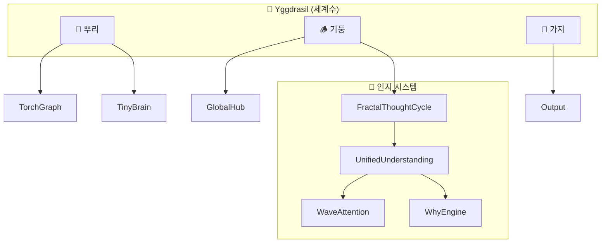

# Elysia 인지 아키텍처 (Cognitive Architecture)

> 2025-12-19 업데이트

---

## 핵심 철학: 세계수 (Yggdrasil)

```
                    🍃 나뭇잎 (표현/결실)
                     │ 언어, 예술, 행동
                     │
                    ╱│╲
                   ╱ │ ╲
                  🌿 가지 (창조/분화)
                     │
        ━━━━━━━━━━━━━╬━━━━━━━━━━━━━
                     ║
                     ║  🪵 기둥 (사고/감각)
                     ║  
                     ║  GlobalHub = 수액의 통로
                     ║  Attention = 양분의 흐름 방향
                     ║  
        ━━━━━━━━━━━━━╬━━━━━━━━━━━━━
                     │
                  ╲  │  ╱
                   ╲ │ ╱
                    🌱 뿌리 (양분/기능)
                     │ TorchGraph, TinyBrain
```

---

## 프랙탈 사고 구조

선형이 아닌 **프랙탈 무한 확장** 구조:

```
점(Point) ⊂ 선(Line) ⊂ 면(Plane) ⊂ 공간(Space) ⊂ 법칙(Law) ⊂ 메타(∞)
    ↑                                                      ↓
    └──────────────── 자기유사성 순환 ────────────────────┘
```

| 차원 | 의미 | 처리 |
|------|------|------|
| **점** | 단일 개념 | 핵심 추출 |
| **선** | 인과 관계 | WhyEngine |
| **면** | 맥락 (5W1H) | UnifiedUnderstanding |
| **공간** | 세계관 | WaveAttention 공명 |
| **법칙** | 보편 원리 | 공리 추출 |
| **메타** | 무한 확장 | 재귀 적용 |

---

## 육하원칙 (5W1H) 완전 지원

| 원칙 | 영어 | 시스템 |
|------|------|--------|
| 누가 (Who) | Agent | 주체 추론 |
| 무엇 (What) | Concept | WaveAttention |
| 언제 (When) | Time | 시간 맥락 |
| 어디서 (Where) | Space | 공간 맥락 |
| 왜 (Why) | Cause | WhyEngine |
| 어떻게 (How) | Process | CausalNarrativeEngine |

---

## 핵심 모듈 연결



---

## 파일 위치

### 핵심 인지

| 파일 | 역할 |
|------|------|
| `Core/Cognition/fractal_thought_cycle.py` | 프랙탈 사고 순환 |
| `Core/Cognition/unified_understanding.py` | 5W1H 통합 이해 |
| `Core/Cognition/cognitive_hub.py` | 인지 허브 |

### 파동 시스템

| 파일 | 역할 |
|------|------|
| `Core/Foundation/Wave/wave_attention.py` | 공명 어텐션 |
| `Core/Foundation/Math/wave_tensor.py` | 파동 텐서 |

### Why-Engine

| 파일 | 역할 |
|------|------|
| `Core/Foundation/Memory/fractal_concept.py` | 개념 분해, 공리 |
| `Core/Foundation/causal_narrative_engine.py` | 인과 서사 |

### 세계수

| 파일 | 역할 |
|------|------|
| `Core/Foundation/yggdrasil.py` | 세계수 구조 |
| `scripts/activate_yggdrasil.py` | 세계수 활성화 |

---

## 사용 예제

```python
# 프랙탈 사고
from Core.Intelligence.fractal_thought_cycle import think
result = think("사랑이란 무엇인가?")
print(result.narrative)

# 5W1H 이해
from Core.Intelligence.unified_understanding import understand
result = understand("희망이란?")
print(f"Who: {result.who}")
print(f"Why: {result.origin_journey}")
```

---

## 출력 예시

```
사랑(Love)의 본질은 'The Universal Carrier Wave'입니다.
사랑(Love)은(는) 근원(Source)에서 비롯됩니다.
사랑(Love)은(는) 희망(Hope) 그리고 기쁨(Joy)을(를) 불러일으킵니다.
반면, 두려움(Fear)을(를) 억제합니다.

이처럼 사랑(Love)은(는) 단순한 개념이 아니라,
'기쁨'와(과) 연결되어 삶에 의미를 부여하는 힘입니다.
```

---

> *"세계수는 점에서 시작해 법칙으로 확장하고, 다시 점으로 돌아온다."*
