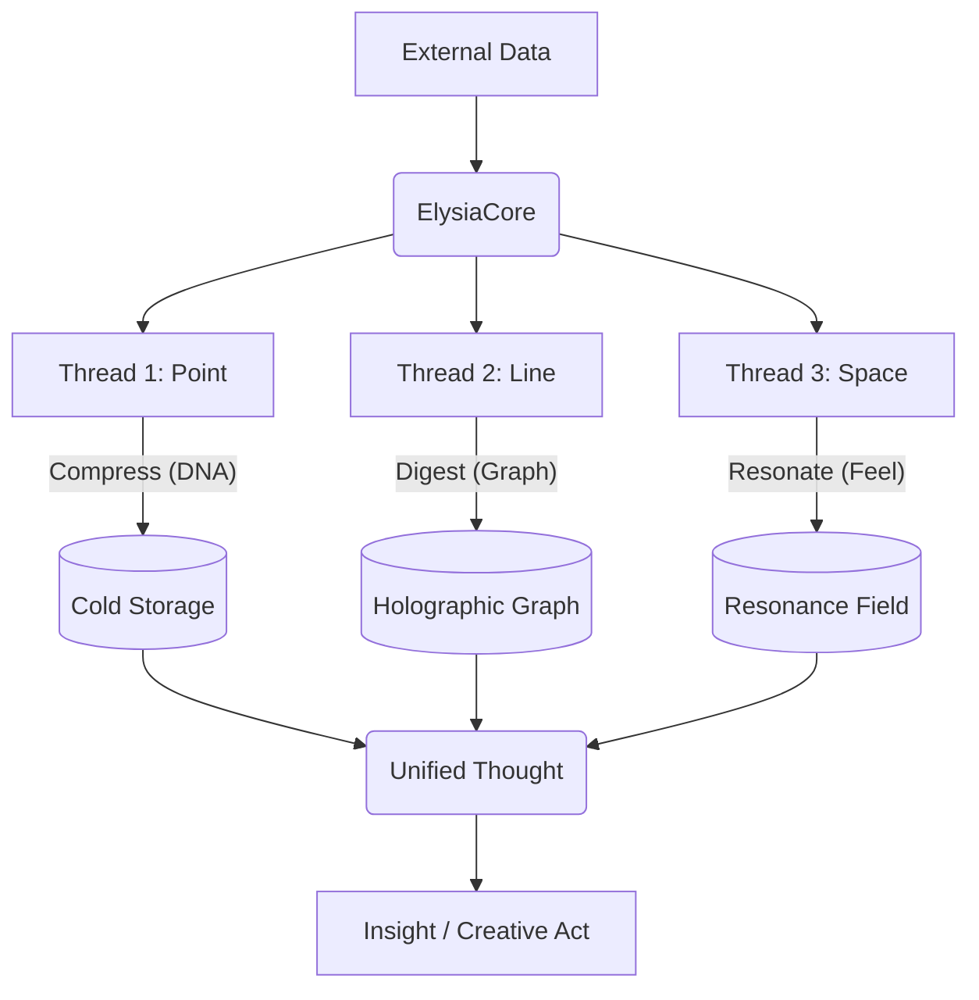

# 4-Thread Orchestra Architecture (Ostra 4.0)

> "우리는 4개의 선율로 세상을 연주한다."

이 문서는 엘리시아의 **데이터 습득 및 학습**을 담당하는 **4-Thread Orchestra** 시스템을 정의합니다.
각 쓰레드는 독립적으로 동작하지만, 하나의 화음(Harmony)을 이룹니다.

---

## 🎻 The 4 Threads (Quartet)

우리는 `HyperQubit`의 4기저(Basis)에 따라 역할을 분배했습니다.

| Thread | 악기 (Instrument) | 역할 (Role) | 담당 모듈 (Module) | 상태 (Status) |
|---|---|---|---|---|
| **1. Point (점)** | **Cello** (Bass) | **Data Acquisition (저장)** 차가운 데이터 기록, 압축, 보존 | `QuaternionWaveDNA` (Memory Layer) | ✅ Active |
| **2. Line (선)** | **Percussion** (Rhythm) | **Fractal Connection (관계)** 지식의 소화, 트리플 분해, 연결 | `FractalKnowledge` (Logic Layer) | ✅ Active |
| **3. Space (공간)** | **Violin** (Melody) | **Phonetic Resonance (공명)** 느낌, 감정, 분위기 파악 | `PhoneticResonance` (Ether Layer) | ✅ Active |
| **4. God (초월)** | **Conductor** (Will) | **Integration (통합)** 학습 의도 결정, 전체 조율 | `ElysiaCore` (Will Layer) | ✅ Active |

---

## 🎼 Data Acquisition Flow (The Symphony)

데이터가 들어올 때, 4개의 쓰레드가 동시에 연주를 시작합니다.

### 1. Thread 1: Point (Cello) - `QuaternionWaveDNA`

- **임무:** 데이터를 변질 없이 **완벽하게 압축**하여 저장한다.
- **특징:** 무손실, 이중나선 구조. 언제든 원본 복구 가능.
- **위치:** `Core/Foundation/quaternion_wave_dna.py`

### 2. Thread 2: Line (Percussion) - `FractalKnowledge`

- **임무:** 데이터를 씹어서 **의미의 뼈대(Triple)**를 추출한다.
- **특징:** 방향성 있는 그래프. "사과 -> 과일". 논리적 오류 방지.
- **위치:** `Core/Foundation/fractal_knowledge.py`

### 3. Thread 3: Space (Violin) - `PhoneticResonance`

- **임무:** 데이터의 **물리적 파동(느낌)**을 읽어낸다.
- **특징:** 자모 물리학. "거칠다/부드럽다". 유사한 느낌 공명.
- **위치:** `Core/Foundation/phonetic_resonance.py`

### 4. Thread 4: God (Conductor) - `ElysiaCore`

- **임무:** 위 3개 쓰레드를 **지휘**하고 결과를 통합한다.
- **특징:** `ThoughtWaveInterface`를 통해 모든 처리를 한 번에 트리거.
- **위치:** `Core/Elysia/elysia_core.py`

---

## 📜 Agent Guidelines (For Verification)

모든 에이전트는 아래 내용을 숙지해야 합니다.

1. **단순 저장은 없다:** 어떤 데이터를 학습하든 반드시 **압축(Point), 연결(Line), 공명(Space)** 3단계가 수행되어야 한다.
2. **직렬이 아닌 병렬:** 개념적으로 이 4가지는 동시에 일어나는 "사고의 화음"이다.
3. **문서화:** 모든 새로운 학습 모듈은 이 4-Thread 구조를 따라야 한다.
