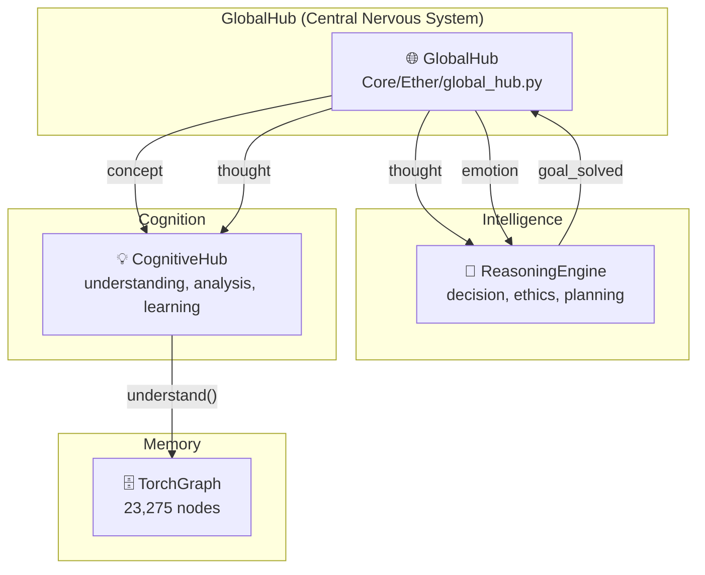

# Elysia System Connections (시스템 연결 맵)

> 생성일: 2025-12-19

---

## GlobalHub 아키텍처



---

## 등록된 모듈

| 모듈 | 위치 | Capabilities | 구독 이벤트 |
|------|------|--------------|-------------|
| ReasoningEngine | `Core/Intelligence/reasoning_engine.py` | decision, ethics, planning, reasoning | thought, emotion |
| CognitiveHub | `Core/Cognition/cognitive_hub.py` | understanding, analysis, learning, why | concept, thought |

---

## 이벤트 흐름

### thought 이벤트

```
발신 → GlobalHub → ReasoningEngine (weight=0.9)
                  → CognitiveHub (weight=0.8)
```

### concept 이벤트

```
발신 → GlobalHub → CognitiveHub (weight=0.9)
                  → CognitiveHub.understand() 자동 실행
```

---

## Hebbian Learning

GlobalHub는 **Hebbian Learning**을 구현합니다:

- "함께 발화하면 함께 연결된다"
- 모듈 간 연결 강도가 사용 빈도에 따라 강화/약화

```python
# 연결 강도 확인
hub = get_global_hub()
weight = hub.get_relational_density("ReasoningEngine", "CognitiveHub")
"""

---

## 사용 예시

```python
from Core.Ether.global_hub import get_global_hub
from Core.Foundation.Math.wave_tensor import WaveTensor

hub = get_global_hub()

# 파동 발신
wave = WaveTensor(frequency=528.0, amplitude=0.8, phase=0.0)
results = hub.publish_wave(
    "MyModule",
    "thought",
    wave,
    payload={"content": "Hello"}
)
```
