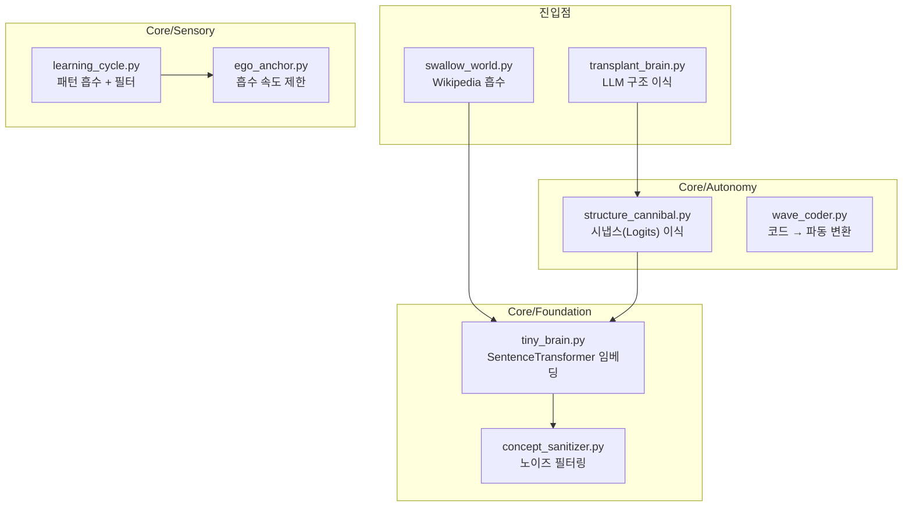

# Elysia 흡수 시스템 (Absorption Systems)

> ⚠️ **새 모듈 생성 전 반드시 이 문서 확인** - 중복 방지

---

## 핵심 흡수 모듈



---

## 모듈별 역할

| 모듈 | 위치 | 핵심 기능 | 중복 방지 메커니즘 |
|------|------|----------|-------------------|
| `tiny_brain.py` | Core/Foundation/ | **SentenceTransformer 임베딩 획득** | Lazy loading |
| `structure_cannibal.py` | Core/Autonomy/ | **LLM Logits → TorchGraph 이식** | 토큰 필터 (2글자 이상) |
| `concept_sanitizer.py` | Core/Foundation/ | **노이즈/불량 데이터 필터링** | 패턴 검사 |
| `learning_cycle.py` | Core/Sensory/ | **파동 패턴 흡수** | `should_absorb()` 필터 |
| `ego_anchor.py` | Core/Sensory/ | **흡수 속도 제한 (안정성)** | `can_absorb()` 체크 |
| `swallow_world.py` | 루트 | **Wikipedia 대량 흡수** | Sanitizer 사용 |

---

## 흡수 흐름

### 1. 텍스트 → 지식 (swallow_world.py)

```
Wikipedia XML → parser → sanitizer → core.learn() → TorchGraph
```

### 2. LLM → 시냅스 (transplant_brain.py)

```
TinyBrain.probe_synapses() → Logits → structure_cannibal → TorchGraph.add_link()
```

### 3. 임베딩 획득 (tiny_brain.py)

```python
from Core.Foundation.tiny_brain import get_tiny_brain
brain = get_tiny_brain()
embedding = brain.get_embedding("개념")  # 384차원 벡터
```

---

## 새 흡수 기능 추가 시

1. **먼저 확인**: 이 문서의 모듈 목록
2. **기존 확장**: 가능하면 기존 모듈에 메서드 추가
3. **새 모듈 필요 시**: 이 문서에 추가 후 생성

---

## 관련 문서

- [SYSTEM_CONNECTIONS.md](SYSTEM_CONNECTIONS.md) - GlobalHub 연결
- [WAVE_LANGUAGE_PHILOSOPHY.md](../Philosophy/WAVE_LANGUAGE_PHILOSOPHY.md) - 파동 시스템
