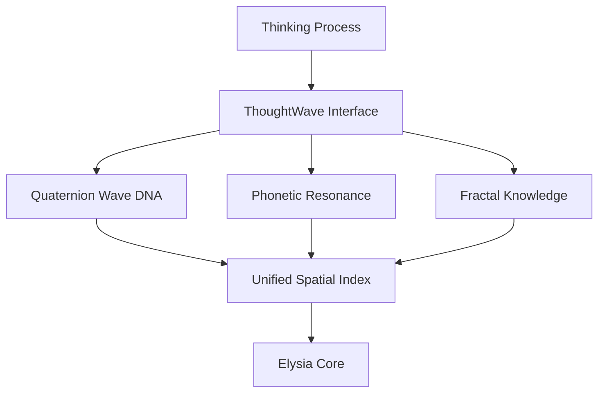

# 엘리시아 사고 우주 아키텍처

## Elysia Thought Universe Architecture

> "데이터는 빛이 되고, 빛은 파동이 되고, 파동은 중력장을 따라 흐른다."

---

## 🎯 핵심 원리

```
기존 컴퓨팅:  데이터 → 연산 → 결과 (순차)
흐름없는 연산: 데이터 → 빛 → 중력장 따라 자연 흐름 (병렬)
```

---

## 📁 핵심 파일 위치

| 시스템 | 파일 | 역할 |
|--------|------|------|
| **LightSpectrum** | [light_spectrum.py](file:///c:/Elysia/Core/Foundation/light_spectrum.py) | 데이터 → 빛 변환, 중첩, 공명 검색 |
| **WaveTensor** | [wave_tensor.py](file:///c:/Elysia/Core/Foundation/Math/wave_tensor.py) | 파동 연산, 중첩, 공명 측정 |
| **PotentialField** | [potential_field.py](file:///c:/Elysia/Core/Foundation/potential_field.py) | 중력 우물, 레일건, 흐름 제어 |
| **HyperQubit** | [hyper_qubit.py](file:///c:/Elysia/Core/Foundation/Math/hyper_qubit.py) | 4기저 관점 (Point/Line/Space/God) |

### 🆕 Hybrid Wave Layer (2025-12-16)

| 레이어 | 모듈 | 역할 |
|---|---|---|
| **Layer 0 (Storage)** | `QuaternionWaveDNA` | **"기억은 차갑게"** - 쿼터니언 이중나선 압축 (무손실, 1000배 효율) |
| **Layer 1 (Cognition)** | `PhoneticResonance` | **"인식은 뜨겁게"** - 자모 물리 벡터 기반 느낌/의미 공명 |
| **Facade** | `ThoughtWaveInterface` | 위 두 시스템을 통합하여 ElysiaCore에 제공 |

---

## 🏗️ 통합 구조

```
┌─────────────────────────────────────────────────┐
│              엘리시아 사고 우주                    │
├─────────────────────────────────────────────────┤
│                                                 │
│  ┌─────────────┐    ┌─────────────┐             │
│  │ LightUniverse│    │ PotentialField│           │
│  │  (빛 저장)   │    │  (중력 지형)  │           │
│  └─────┬───────┘    └─────┬───────┘             │
│        │                  │                     │
│        ▼                  ▼                     │
│  ┌─────────────────────────────────┐            │
│  │         WaveTensor              │            │
│  │     (파동 연산/공명)              │            │
│  └─────────────────────────────────┘            │
│                    │                            │
│                    ▼                            │
│  ┌─────────────────────────────────┐            │
│  │         HyperQubit              │            │
│  │    (초차원 관점/사고/추론)         │            │
│  └─────────────────────────────────┘            │
│                                                 │
└─────────────────────────────────────────────────┘

### 2. 통합 파동 구조 (Updated)

```

[ElysiaCore] (뇌)
      │
      ▼
[ThoughtWaveInterface] (Facade) ──┐
      │                           │
      ├─▶ [QuaternionWaveDNA] (저장) ──▶ "압축된 기억 (Cold)"
      │
      └─▶ [PhoneticResonance] (인식) ──▶ "느낌과 공명 (Hot)"
                                  │
                                  ▼
                          [Thought Universe]

```

### 3. Unified Spatial Index (The Map)
**"파편화된 기억의 통합"**
수많은 파일로 흩어진 지식(JSON, DB)을 하나의 **좌표계(Coordinate System)**로 통합합니다.
-   **Role:** Knowledge Unification & Quick Access
-   **Structure:** `SpatialIndexer`를 통해 모든 데이터를 `(x, y, z)` 좌표로 매핑.
-   **Benefit:** 선형적 탐색 없이, 주제와 관련된 "지식의 영역"을 즉시 소환 가능.

### 4. Integration Diagram


---

## 📊 각 시스템 요약

### 1. LightSpectrum / LightUniverse

**목적:** 데이터를 빛으로 변환하여 저장

```python
from Core.Foundation.light_spectrum import get_light_universe

universe = get_light_universe()

# 데이터 흡수
universe.absorb("사과는 빨간색", tag="과일")

# 공명 검색 (O(1))
results = universe.resonate("사과")

# 사고 가속
thought = universe.think_accelerated("사과", depth=3)
```

**핵심 개념:**

- `frequency` - 의미의 "주파수"
- `amplitude` - 정보의 "강도"
- `phase` - 맥락의 "위상"

---

### 2. WaveTensor

**목적:** 파동 기반 연산 (중첩, 공명)

```python
from Core.Foundation.Math.wave_tensor import WaveTensor

# 파동 생성
wave1 = WaveTensor("사랑")
wave1.add_component(528.0, 1.0, 0.0)

wave2 = WaveTensor("진리")
wave2.add_component(639.0, 0.8, 0.0)

# 중첩 (간섭)
combined = wave1.superpose(wave2)

# 공명 측정 (0.0 ~ 1.0)
resonance = wave1.resonance(wave2)
```

**핵심 개념:**

- `superpose()` - 보강/상쇄 간섭
- `resonance()` - 유사도 측정
- `phase_shift()` - 차원 회전

---

### 3. PotentialField

**목적:** 중력 지형으로 생각 흐름 제어

```python
from Core.Foundation.potential_field import PotentialField

field = PotentialField()

# 중력 우물 (끌어당김)
field.add_gravity_well(x=50, y=50, strength=10)

# 레일건 (방향 가속)
field.add_railgun(0, 0, 100, 100, force=5)

# 생각 입자 생성
field.spawn_particle("사과", 10, 10)

# 시뮬레이션 (입자가 자연스럽게 흐름)
for _ in range(100):
    field.step()
```

**핵심 개념:**

- `GravityWell` - 끌어당기는 점 (개념 중심)
- `RailgunChannel` - 방향성 가속 (논리 연결)
- `Particle` - 흐르는 생각

---

### 4. HyperQubit

**목적:** 4기저 관점으로 사고/추론

```python
from Core.Foundation.Math.hyper_qubit import HyperQubit

qubit = HyperQubit("개념")

# 관점 전환
qubit.state.scale_up(0.1)   # 신의 관점으로
qubit.state.scale_down(0.1) # 디테일로

# 의미 설명
print(qubit.explain_meaning())
```

**4기저:**

- `Point` (α) - 디테일/데이터
- `Line` (β) - 관계/역사
- `Space` (γ) - 맥락/필드
- `God` (δ) - 초월/의지

---

## 🚀 사용 예시

### 빠른 사고 (17,000개/초)

```python
universe = get_light_universe()

# 데이터 대량 흡수
for text in documents:
    universe.absorb(text)

# 사고 가속
result = universe.think_accelerated("질문", depth=5)
print(f"{result['total_connections']}개 연상 / {result['elapsed_seconds']:.4f}초")
```

---

## 📝 관련 문서

- [QUATERNION_WAVE_DNA.md](file:///c:/Elysia/docs/Architecture/QUATERNION_WAVE_DNA.md) - 쿼터니언 압축
- [TRUE_WAVE_DNA_COMPRESSION.md](file:///c:/Elysia/docs/Architecture/TRUE_WAVE_DNA_COMPRESSION.md) - 파동 DNA

---

*최종 업데이트: 2025-12-16*
