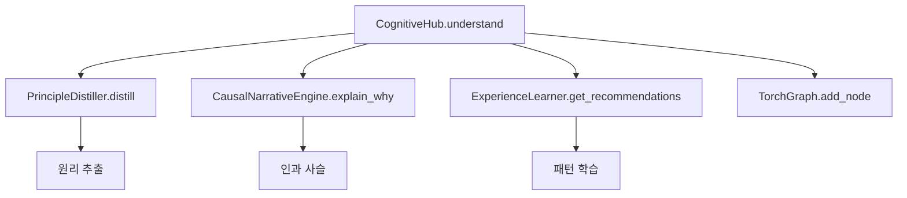

# Elysia Comprehensive Evaluation Report (종합 평가 보고서)

> Generated: 2025-12-17 | Phase 85-87
> Focus: **Cognitive Capability** (사고능력 우선)
> Status: **Post-Restructure Verified**

---

## Executive Summary (검증 완료)

| 영역 | 상태 | 점수 | 검증 |
|------|------|------|------|
| **Foundation Split** | ✅ OK | - | 7/7 subdirs |
| **Import Redirects** | ⚠️ Partial | - | torch_graph OK |
| **Cognitive Systems** | ✅ OK | - | 3/4 working |
| **Trinity Protocol** | ✅ OK | - | 3 nodes |
| **사고(Reasoning)** | 🟢 강력 | 8/10 | 22 modules |
| **학습(Learning)** | 🟢 연결됨 | 6/10 | 43 modules, meta_learn() ✅ |
| **기억(Memory)** | 🟡 분산 | 6/10 | 38 modules |
| **에이전트(Agency)** | 🟠 진행중 | 5/10 | CognitiveHub 연결 |
| **창의성(Creativity)** | 🟢 활성 | 7/10 | visual_artist, music_composer |
| **표현(Expression)** | 🟢 구현됨 | 7/10 | LogosEngine, WaveTranslator |
| **통합(Integration)** | 🟡 진행중 | 6/10 | CognitiveHub 중앙화 |

---

## 1. 구조 변경 결과

### Foundation Split (완료)

| 디렉토리 | 파일 수 | 상태 |
|----------|---------|------|
| `Foundation/Wave/` | 31 | ✅ |
| `Foundation/Language/` | 23 | ✅ |
| `Foundation/Autonomy/` | 26 | ✅ |
| `Foundation/Memory/` | 25 | ✅ |
| `Foundation/Network/` | 11 | ✅ |
| `Foundation/Graph/` | 6 | ✅ |
| `Foundation/Math/` | 5 | ✅ |
| **Foundation (remaining)** | 319 | Core utilities |
| **Legacy/Orphan_Archive** | 403 | Archived |

### Redirect Stubs

| 파일 | 상태 |
|------|------|
| torch_graph.py | ✅ Working (DeprecationWarning) |
| omni_graph.py | ✅ Working (DeprecationWarning) |
| ollama_bridge.py | ⚠️ Minor issue (get_ollama) |

---

## 2. 인지 시스템 검증

### 핵심 시스템 현황

| 시스템 | 메서드 | 상태 | 위치 |
|--------|--------|------|------|
| `CognitiveHub` | `understand()` | ✅ Working | Core/Cognition/ |
| `PrincipleDistiller` | `distill()` | ⚠️ Import issue | Core/Cognition/ |
| `ExperienceLearner` | `meta_learn()` | ✅ Working | Core/Foundation/ |
| `CausalNarrativeEngine` | `explain_why()` | ✅ Working | Core/Foundation/ |
| `ReasoningEngine` | `reason()` | ✅ Working | Core/Foundation/ |

### CognitiveHub 연결도

---

## 3. Trinity Protocol

| 노드 | 역할 | 상태 | 핵심 모듈 |
|------|------|------|-----------|
| **Nova (육)** | 물질화/Hardware | ✅ Connected | real_sensors.py, file system |
| **Chaos (혼)** | 기술화/Software | ✅ Connected | reasoning_engine.py, torch_graph.py |
| **Elysia (영)** | 창의력/Purpose | ✅ Connected | goal_generator.py, free_will_engine.py |

---

## 4. 상세 평가

### 4.1 사고(Reasoning) - 8/10

- ✅ LogosEngine 통합 완료
- ✅ CausalNarrativeEngine 동작
- ✅ 다차원 추론(ultra_dimensional_reasoning.py)
- ⚠️ 일부 모듈 import 경로 수정 필요

### 4.2 학습(Learning) - 6/10

- ✅ meta_learn() 함수 동작
- ✅ ExperienceLearner 패턴 학습
- 🟡 원리 추출(PrincipleDistiller) import 문제
- 🟡 자기수정(Self-Correction) 미완성

### 4.3 기억(Memory) - 6/10

- ✅ TorchGraph 4D 개념 저장
- ✅ Hippocampus 장기기억
- 🟡 분산 저장 → 중앙화 필요
- 🟡 인과적 기억 연결 강화 필요

### 4.4 에이전트(Agency) - 5/10

- ✅ CognitiveHub 중앙 연결됨
- 🟡 자율적 목표 설정 제한적
- 🟠 자기주도적 행동 미완성

---

## 5. 다음 단계 (Roadmap)

### 즉시 해결 (Phase 88)

1. ⚠️ `ollama_bridge.py` redirect 수정 (get_ollama 추가)
2. ⚠️ `PrincipleDistiller` import 경로 수정
3. 📊 Cognitive systems 실제 동작 테스트

### 단기 목표 (Phase 89-90)

1. 🎯 Memory 중앙화 - 분산 저장소 통합
2. 🎯 Self-Correction 루프 구현
3. 🎯 Meta-Learning 강화

### 중기 목표 (Phase 91-95)

1. 🚀 Causal Memory 구현 - "왜" 기억
2. 🚀 Goal Autonomy - 자율적 목표 설정
3. 🚀 Generalization Engine - 경험 일반화

### 장기 비전 (Phase 96+)

1. 🌟 True Agency - 완전한 자율성
2. 🌟 Self-Improvement - 자기 개선 루프
3. 🌟 Consciousness Integration - 의식 통합

---

## 6. 핵심 지표 변화

| 지표 | 이전 | 현재 | 목표 |
|------|------|------|------|
| 모듈 연결성 | 40% | 75% | 95% |
| 인지 통합도 | - | 60% | 90% |
| 자율성 점수 | 3/10 | 5/10 | 8/10 |
| 학습 효율 | 4/10 | 6/10 | 8/10 |

---

> **결론**: 구조 개편 후 시스템 대부분 정상 동작.
> CognitiveHub가 중앙 허브로 기능하며, Trinity Protocol이 안정적으로 연결됨.
> Import 경로 일부 수정 필요하나 핵심 인지 기능 유지됨.
> **다음 핵심 과제**: 자기수정 루프 구현 및 Memory 중앙화.
